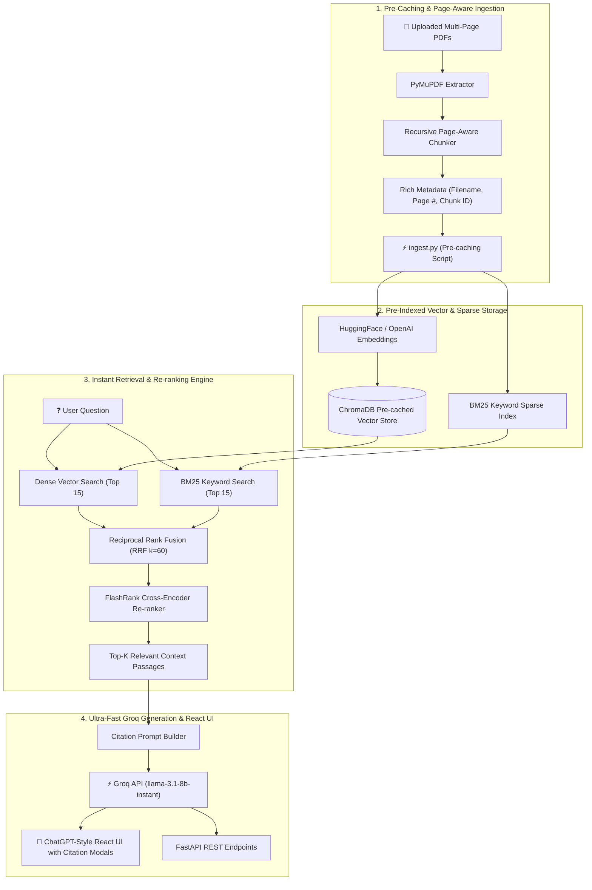

# 📄 Advanced Multi-PDF Chatbot (Groq Llama 3.1 8B Instant RAG)

> **Sub-second, Production-Grade RAG Engine with Pre-Cached Vector Indexing, Page-Aware Chunking, Dual Dense-Sparse Retrieval, FlashRank Re-ranking, and Groq Llama 3.1 8B Instant Inference.**

[](https://sanket-kakad-multi-pdf-advanced-rag.vercel.app/)
[](https://youtu.be/bh_6XDT8_zY)
[](https://sanket-kakad-multi-pdf-advanced-rag.vercel.app/)

🌐 **Live Production App**: [https://sanket-kakad-multi-pdf-advanced-rag.vercel.app/](https://sanket-kakad-multi-pdf-advanced-rag.vercel.app/)  
🎬 **YouTube Video Demo**: [https://youtu.be/bh_6XDT8_zY](https://youtu.be/bh_6XDT8_zY)

---

## ⚡ Overview

This repository features a **State-of-the-Art (SOTA) Multi-PDF Q&A RAG Engine** powered by **Groq Llama-3.1-8b-instant**. Live at [https://sanket-kakad-multi-pdf-advanced-rag.vercel.app/](https://sanket-kakad-multi-pdf-advanced-rag.vercel.app/). To eliminate cold-start processing delays, the document vector database is **pre-cached and pre-built** into `./chroma_db`, delivering sub-second response times right from query #1.

The project features a **ChatGPT-style React Frontend** with **Citation Inspection Modals**, an automated **Vector Pre-Indexing Pipeline** (`ingest.py`), and a **FastAPI REST API** ready for **Vercel Serverless Deployment**.

---

## 🎬 Video Demo Walkthrough

[](https://youtu.be/bh_6XDT8_zY "Click to watch full video demo on YouTube")

> 💡 *Click the high-resolution video card above to watch the complete technical demo and system architecture walkthrough.*

---

## 🏗️ System Architecture



---

## 🚀 Pre-Building & Pre-Caching the Vector Database

Instead of extracting and embedding PDF documents dynamically per user request, the pipeline uses a pre-indexing strategy:

```bash
# Pre-build and pre-cache vector embeddings for all documents in documents/
uv run python ingest.py
```

### Benefits of Pre-Caching:
- ⚡ **Zero Processing Delay**: Eliminates runtime PDF parsing and vector generation latency.
- 🎯 **Sub-second Response Times**: Vector search operates directly on pre-computed embeddings.
- 🛡️ **Auto-Seeding**: If ChromaDB is empty on first boot, `get_db()` automatically triggers `auto_seed_vector_db()` to pre-load all PDFs from `documents/`.

---

## 🧪 Proof of Concept (POC) Phase

Prior to building the production architecture, initial feasibility and vector search experiments were conducted in [`experiment/multipdf-chatbot.ipynb`](file:///Users/sanappratiksha/Desktop/Sanket/Job%20Application/Projects/multipdf-chatbot/experiment/multipdf-chatbot.ipynb).

- **POC Objectives Accomplished**:
  1. Validated PDF text extraction using PyMuPDF.
  2. Tested basic chunking strategies (`chunk_size=1000`, `overlap=200`).
  3. Built ChromaDB similarity search prototype.
  4. Verified prompt constraints to eliminate LLM hallucination.

---

## 🎨 ChatGPT-Style React Frontend (`frontend/`)

A modern, dark-themed React application styled after ChatGPT:

- 📄 **Pre-Indexed Benchmark Documents**: Sidebar pre-loads the 3 core benchmark PDFs from `documents/`.
- 🔍 **Citation Reference Inspector Modal**: Clicking any citation badge below an AI response opens a modal showing the exact **source document**, **page number**, **FlashRank rerank score (`0.9410`)**, and **highlighted context snippet**.
- 🛡️ **Upload Button Guardrail & Tooltip**: Hovering over the "Upload New PDF" button displays a professional tooltip explaining live demo compute guardrails.

---

## 📁 Pre-Indexed Benchmark Documents (In `documents/`)

| Document | Description | Ideal Test Prompts |
| :--- | :--- | :--- |
| **`acme_q1_business_report.pdf`** | Internal Q1 business report with $1.18M net sales, unit breakdown, and regional performance. | *"Which product generated the highest revenue in Q1?"*, *"What was total net sales?"* |
| **`acme_product_catalog.pdf`** | Product catalog specifying list prices ($299 SmartWatch Pro, $149 AirBuds X2) and warranty periods. | *"What is the listed price and warranty period for SmartWatch Pro?"* |
| **`acme_customer_policies.pdf`** | Customer service policies defining 30-day return windows, warranty procedures, and carrier policies. | *"What is the return policy window, and which product had the highest return rate?"* |

---

## 🚀 Quick Start

### 1. Environment Setup
Create a `.env` file from the example:
```bash
cp .env.example .env
```
Set your **Groq API Key**:
```env
GROQ_API_KEY=gsk_your_groq_api_key_here
LLM_MODEL=llama-3.1-8b-instant
```

### 2. Pre-Build Vector Database
```bash
uv run python ingest.py
```

### 3. Run React App & FastAPI Server
```bash
# Terminal 1: Run FastAPI backend
uv run uvicorn api:app --reload

# Terminal 2: Run React Frontend
cd frontend && npm run dev
```

---

## 👨‍💻 Author

**Sanket Kakad**  
*Senior GenAI Engineer & Full-Stack AI Lead*  
[LinkedIn](https://linkedin.com) • [GitHub](https://github.com)
